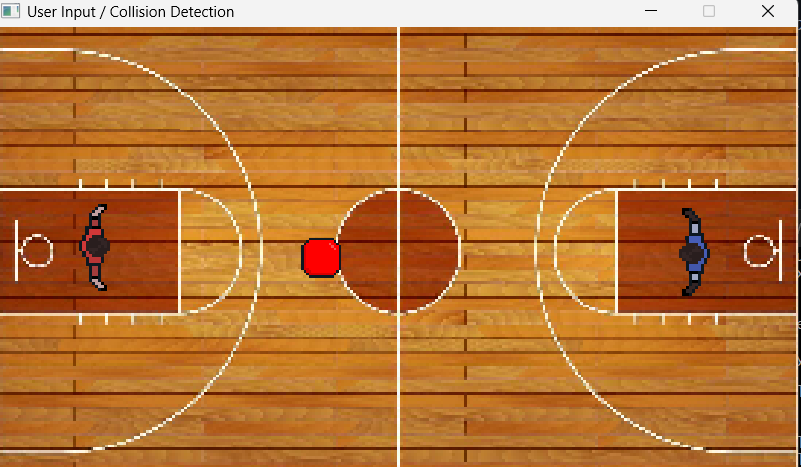
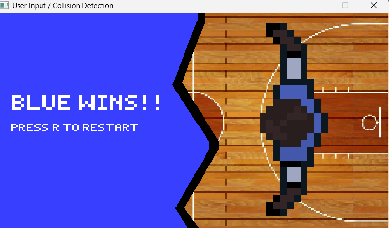

A clone of the popular game pong that I made for my games programming class! 
Written in C++ with Raylib. 

To run, you have two options: 
1. Simply run raylib_app.exe
2. clone, cd into the folder, and run the "make run" command. 
Controls:
WS - Move left paddle up and down.
Up arrow, down arrow - Move right paddle up and down.
T - toggle between singleplayer and multiplayer (singleplayer makes right paddle a bot)
R - restart
1,2,3 - Choose whether to have 1 ball, 2 balls or 3 balls in play! 

Have Fun!!!

